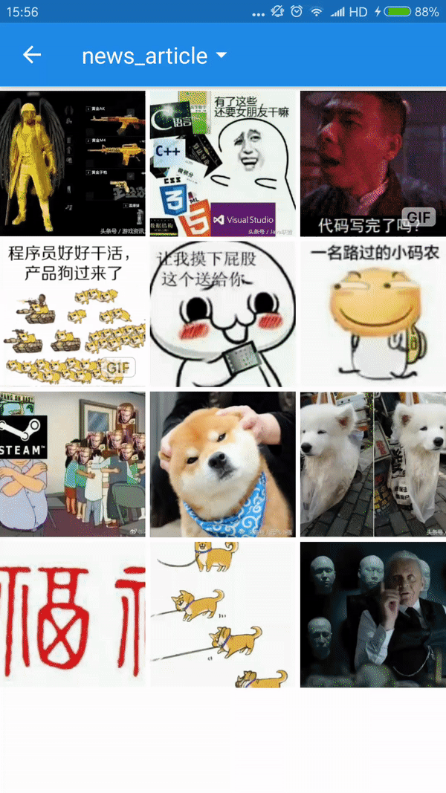

#本项目fork自[Matisse](https://github.com/zhihu/Matisse)，集成[uCrop](https://github.com/Yalantis/uCrop)裁剪功能，主要就是做了点功能组合，就不上传远程库了。大家可以在Release里下载arr包。 

[Matisse](https://github.com/zhihu/Matisse)在这里查看Matisse图片选择器相关文档

[uCrop](https://github.com/Yalantis/uCrop)在这里查看uCrop图片裁剪相关文档

##效果图



```java
              File tempFile = new File(Environment.getExternalStorageDirectory(), "test.jpg"); //设置截图后的保存路径
              Uri uri = Uri.fromFile(tempFile);
              UCrop.Options options = new UCrop.Options();//uCrop的参数设置
              options.setCircleDimmedLayer(true);
              options.setAllowedGestures(UCropActivity.SCALE,UCropActivity.SCALE,UCropActivity.SCALE);
              options.setToolbarColor(ContextCompat.getColor(SampleActivity.this, R.color.zhihu_primary));
              options.setStatusBarColor(ContextCompat.getColor(SampleActivity.this, R.color.zhihu_primary_dark));
              Matisse.from(SampleActivity.this)
                     .choose(MimeType.ofAll(), false)
                     .capture(true)
                     .crop(true)     //设置为true后，才会进入截图模式，默认为false，进入为知乎普通图片选择器
                     .cropOptions(options) //设置uCrop裁剪参数
                     .cropUri(uri)         //设置截图后的保存路径
                     .captureStrategy(new CaptureStrategy(true, "com.zhihu.matisse.sample.fileprovider"))
                     .addFilter(new GifSizeFilter(320, 320, 5 * Filter.K * Filter.K))
                     .gridExpectedSize(getResources().getDimensionPixelSize(R.dimen.grid_expected_size))
                     .restrictOrientation(ActivityInfo.SCREEN_ORIENTATION_PORTRAIT)
                     .thumbnailScale(0.85f)
                     .imageEngine(new GlideEngine())
                     .forResult(REQUEST_CODE_CHOOSE);
```

数据返回和接收和[Matisse](https://github.com/zhihu/Matisse)一样

```java
List<Uri> mSelected;

@Override
protected void onActivityResult(int requestCode, int resultCode, Intent data) {
    super.onActivityResult(requestCode, resultCode, data);
    if (requestCode == REQUEST_CODE_CHOOSE && resultCode == RESULT_OK) {
        mSelected = Matisse.obtainResult(data);
        Log.d("Matisse", "mSelected: " + mSelected);
    }
}
```
